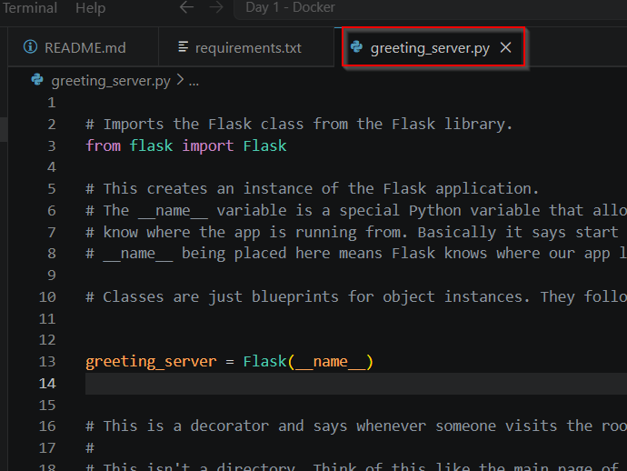
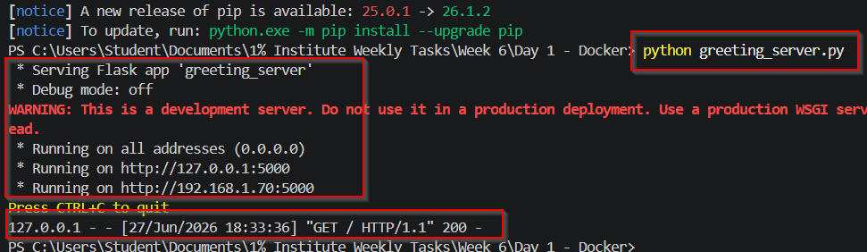
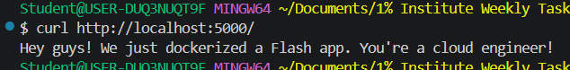
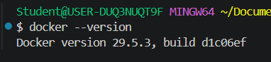
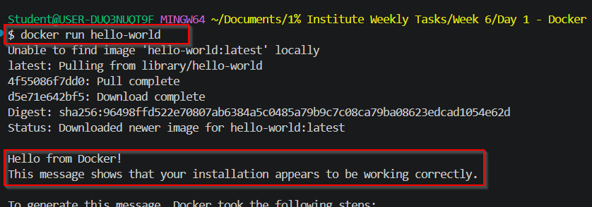
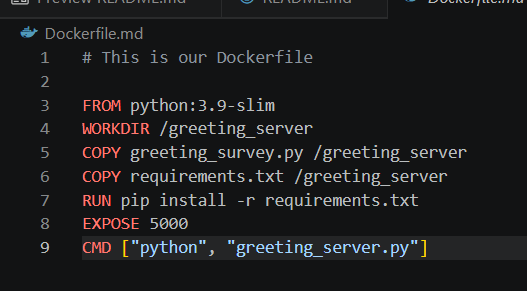
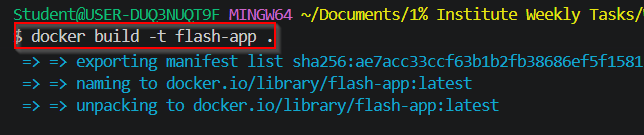
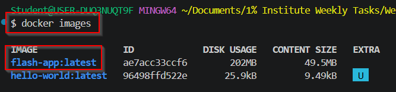
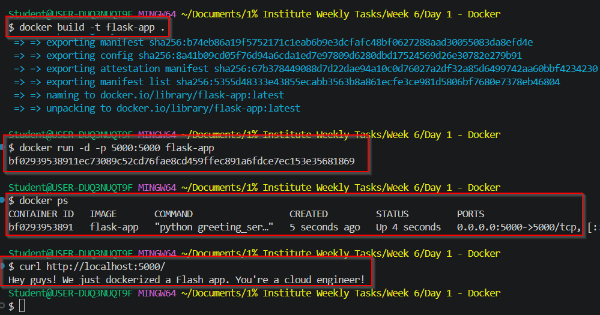

## AWS Cloud Engineer

**Greetings! We'll be going over the tasks for Week 6 - Day 1 of the Cloud Engineering program. Lets get started!**

## Week 6 - Day 1: Action Steps
* Research and Explain Dependencies
* Build a Simple Flask App
* Set Up Docker
* Write and Build a Dockerfile
* Run the Flask App in Docker
* Reflection on Docker's Benefits

________________________

## Research and Explain Dependencies

Welcome back! In today's lab, we'll be deploying containers using Docker! Before we get started, I was asked to research two Python dependencies and explain their roles. What I believe this question is asking is what are two packages that you can install using the Python installer and what do they do. Two hot packages right now are NumPy and Pandas. NumPy is used for scientific computing which I would assume is for dealing with calculus topics. Pandas is for data manipulation so I'm sure data engineer perhaps use this often. 

Dependencies are significant because each version of a package may rely on other packages which have their own specific package version. With each update, packages may gain or lose certain features. The code that you previously had may not function when the new package is updated. Your code and functions are dependent on each other.

Now, lets jump into our lab!

## Build a Simple Flask App

Our first lab task is create a Flask app. We were given code to put in our container that will start up our container to listen on all layer 3 interfaces on port 5000. Once that happens, it starts the Flask server up. The URL path is basically localhost:5000/ so anything traffic that accesses that URL will triggr the hello function. I've explained each part of the code in my script file if you want a deeper explanation. 

Now with all things tech, lets make sure our code works before we deploy it to any container. I went ahead and installed the flask module using `pip install flask` in my VS Code terminal. Once that was completed, I ran my code using `python greeting_server.py`

I used curl to run my python script and received my custom greeting message. This confirms that our code works. Now, lets get it into a container and complete the same task. 

On to the next task. 

## Set Up Docker

Now we need to set up Docker and run the basic "Hello World" container. This is a very starter level task for Docker so lets get that up and running. 

For my Windows users, use `winget install Docker.DockerDesktop` to install Docker. Restart VS Code and then run `docker --version` to confirm Docker is installed. 

Now, lets run that "Hello World" container. I may have to make a Docker account but we're going to google how to run that container and get it going. 

Google says we simply need to run `docker run hello-world`. I ran that command but I ran into a /pipe/docker-daemon issue which made it seem like Docker wasn't actually running. After restaring VS Code, I still had the same issue. Google told me to actually start up the Docker Desktop application first to get the daemon running. I did that and reran the command. 

It looks like that did the trick!

On to the next task!

## Write and Build a Dockerfile

Now, lets actually build the container that will run out `greeting_server.py` script. The lab gave us the configurations for the file but I'll still go over each part of it. 

FROM is the base of the file. It says the base image where we will be building our container. The Python container is a lightweight version of maybe Ubuntu Linux that already has Python installed (hence the -slim wording). 

WORKDIR says hey we'll run all of our commands from this directory and it creates that directory. 

COPY takes the files from your local machine and puts it into the container. 

RUN creates a temporary container that can run Python to install this package for you and then the container disappears. This makes sure the modules in your requirements.txt file are installed on your container forever. 

EXPOSE is actually purely cosmetic. It tells Docker to let people know your container should be using Port 5000 but that doesn't mean your container is configured for that. It's more metadata and displaying, not actual configurations. 

CMD are the commands your container will run automatically when it starts up which is very different than the RUN command. 

That's the breakdown of the file. Lets actually run the Flask app!

## Run the Flask App in Docker

(Before we go into this section, I want to point out that I created a .dockerignore file. This is similar to the .gitignore file where it tells Docker not to pay attention to those files inside the file. I did this because I'm going  to push all of my code up to GitHub and I didn't want to change my file structure because I wasn't creating a separate folder for my Dockerfile and other files. Originally, I was going to use the . /greeting_server for COPY and it was going to copy everything in the folder. I chose to manually write each file out but just in case I didn't, Docker would've ignored them.)

Last but not least, we'll run the app. So we need to build the image and than run an instance of the container. To build the image, use the command `docker build -t flask-app .` which builds an image named flask-app in the current directory. 

I did run into a few naming issues but once I fixed that in my Dockerfile, the build was successful and I was able to see the image once I ran `docker images`

But that's just the image. Lets actually run the command and then curl to it in order to see if our script is working. I should've chosen a different port but that's okay. We'll do that next time. Use the command `docker run -d -p 5000:5000 flask-app` and `docker ps` to see that the container is running. Lastly, we'll run the curl again to make sure we can get to the custom message. 

A little bit about the syntax here, the -d flag is for detached. This is so your container can run in the background. The -p flag is for port matching from your local machine to your container. We want our code to run on port 5000 so this is the literal exposing that port part of the configuration. 

Docker ps is for processes similiar to `ps aux` in regular Linux. 

This confirms our script is working! Don't forget to run `docker stop <container-id-or-name>` to stop the container. Then remove the image to save yourself some space on your hardware. Use `docker rmi <image_name>` to remove the image. On to the last section!

## Reflection on Docker's Benefits

Docker is important because it allows groups of programmers to consistently deploy code in a known working environment. You can look around on your team and notice that people have different workflows. Programmers are the same. Each person has a certain way to do a task and environment set up. If you're able to create a system where their code will confidently work and be able to merge that in with other programmers code, you can create magical projects that really solve problems in the world. 

Docker is just a slice of that pie but it sets the stage to make sure applications are capable of being run no matter what virtual hardware they sit on top of. 

That completes our Docker lab!

## Personal Notes

So I've learned a good amount about containers and chroot environments but sometimes I do forget the simple commands if I haven't used them in a while. I ran into a dependency issue when running my container because one of the flask modules or a module inside it was outdated. I had to add that to my requirements. So even there you're forced to go back over your basics. 

All in all, it was nice to do this. Reminds me of podman when I was studying for the RHCSA. 
